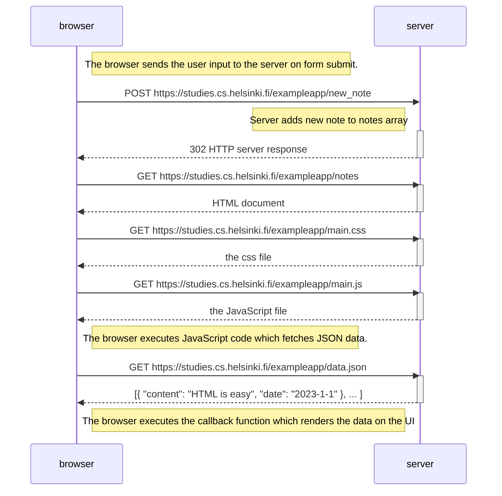

```mermaid
sequenceDiagram
    participant browser
    participant server

    Note right of browser: The browser sends the user input to the server on form submit.

    browser->>server: POST https://studies.cs.helsinki.fi/exampleapp/new_note

    Note left of server: Server adds new note to notes array
    activate server
    server-->>browser: 302 HTTP server response
    deactivate server


    browser->>server: GET https://studies.cs.helsinki.fi/exampleapp/notes
    activate server
    server-->>browser: HTML document
    deactivate server

    browser->>server: GET https://studies.cs.helsinki.fi/exampleapp/main.css
    activate server
    server-->>browser: the css file
    deactivate server

    browser->>server: GET https://studies.cs.helsinki.fi/exampleapp/main.js
    activate server
    server-->>browser: the JavaScript file
    deactivate server

    Note right of browser: The browser executes JavaScript code which fetches JSON data.

    browser->>server: GET https://studies.cs.helsinki.fi/exampleapp/data.json
    activate server
    server-->>browser: [{ "content": "HTML is easy", "date": "2023-1-1" }, ... ]
    deactivate server

    Note right of browser: The browser executes the callback function which renders the data on the UI
```
